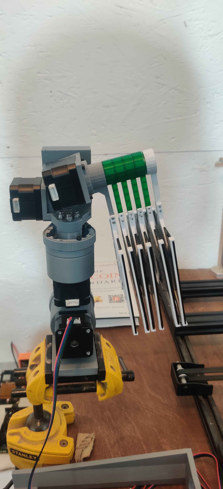
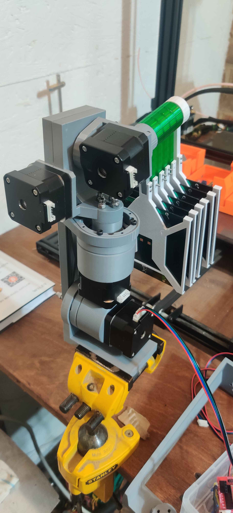
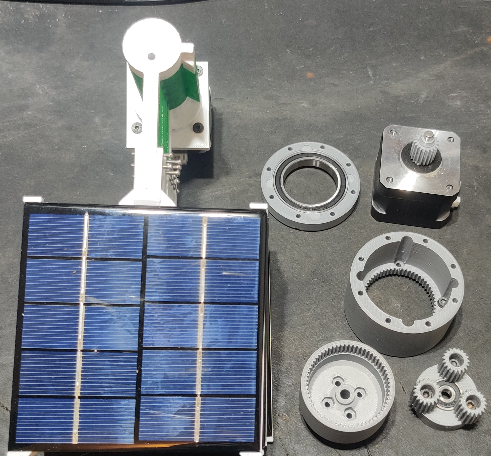

# **Flowerbit** 

## **An <a href="https://osmu.wiki/osmu/about/" target="_blank">OSMU</a> 4 axis low powered solar tracking System Accessory**

### What's in this Repo
#
Not much for now, other than some teaser pics of the prototype build

Stay tuned for updates on the prototype deveopment 

#

**Buy me a coffee**

If you wish to support my work you can donate with BTC: 

⚡ BTC LN : cryptoice@walletofsatoshi.com

⚡ BTC Onchain: 347ePgUhyvztUWVZ4YZBmBLgTn8hxUFNeQ

#
**VIDEO 1 BENCH TEST** ----> https://www.youtube.com/embed/i9iiq9fdAxA
#
**VIDEO 2 FIELD TEST** ----> https://www.youtube.com/embed/x1O7AnvcAgw

16/2/2025 UPDATE: 
made a new custom wiring harness to wire the 6 panels in parallel for a 5V output

#

#

#

#

#

#

#

#
